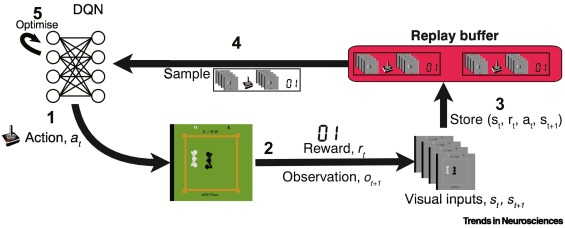
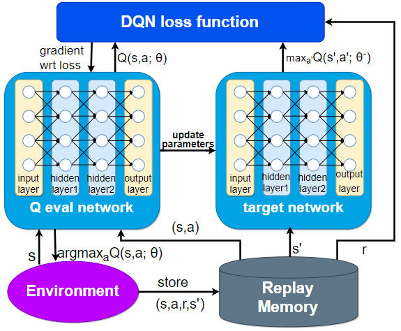

# Project Report: Development and Implementation of a DQN Market Making Agent Using Strategy Studio for Backtesting

This project report details the design, implementation, and backtesting of a Deep Q-Network (DQN) Market Making Agent, conducted to explore innovative approaches to algorithmic trading within the proprietary trading firm. The agent is designed to operate in financial markets, aiming to earn profits from bid-ask spreads while managing inventory levels and mitigating risks. Strategy Studio was employed as the primary software for backtesting the agent's performance in simulated market environments. This project encapsulates a multi-disciplinary approach, integrating deep learning, reinforcement learning (RL), and quantitative finance methodologies.

## Introduction

### Market Making

Market making is a crucial function in financial markets, serving as the backbone for liquidity and price discovery. At its core, market making involves a participant—commonly a firm or an individual—offering to buy and sell a particular asset at all times, thus providing liquidity to other market participants. This activity is essential in facilitating smooth and efficient market operations, enabling participants to execute trades with minimal delay and at predictable prices.

#### The Role of a Market Maker

A market maker quotes two prices: the **bid** price, at which they are willing to buy an asset, and the **ask** (or offer) price, at which they are willing to sell. The difference between these two prices is known as the **spread**, which represents the market maker's potential profit from their operations, compensating for the risk of holding inventory and the service of providing liquidity.

#### Inventory and Risk Management

Market makers manage an inventory of the securities they trade, balancing the need to provide liquidity with the risk of holding large positions that might move against them. Sophisticated strategies, including **stochastic calculus**, **algorithmic trading**, and **quantitative finance** principles, are employed to dynamically adjust quotes based on the current market condition, inventory levels, and volatility. This balancing act is essential for maintaining profitability while ensuring market stability.

#### Profitability and Challenges

The profitability of market making depends on successfully managing the spread between the buy and sell prices and effectively managing inventory risk. Market makers face several challenges, including competition from other market participants, market impact costs, and adverse selection risk, where more informed traders might exploit the market maker's quotes. Advanced **AI/ML techniques**, **generative AI**, and **deep neural networks** are increasingly utilized to analyze market data, predict price movements, and optimize trading strategies, enhancing the market maker's ability to remain competitive and profitable.

#### Contribution to Market Efficiency

By providing continuous buy and sell quotes, market makers facilitate tighter spreads, greater liquidity, and improved price discovery, contributing to the overall efficiency and stability of financial markets. They play a vital role in enabling both retail and institutional investors to execute trades promptly and at fair prices, thus supporting the smooth operation of the global financial system.

In summary, market making is a sophisticated and dynamic area of finance, requiring a deep understanding of market mechanisms, risk management, and advanced technological tools. The ability to adapt to changing market conditions, manage inventory risk, and employ cutting-edge technological solutions is essential for the success and sustainability of market making operations.

### Deep Q Networks

Deep Q-Networks (DQN) represent a landmark convergence of reinforcement learning (RL) and deep learning technologies, driving forward the capabilities of artificial intelligence in decision-making tasks. Originating from the foundational work of combining Q-learning, a model-free reinforcement learning algorithm, with deep neural networks, DQNs were popularized by DeepMind's groundbreaking implementation to master Atari 2600 games directly from pixel inputs. This deep dive into DQNs will unpack their architecture, operation, and significance in the field of AI.

#### Architecture and Principle

At the heart of a DQN is the Q-learning algorithm, which aims to learn the value of an action in a given state, encapsulating this knowledge in a Q-function. Traditionally, Q-learning struggled with high-dimensional state spaces due to the curse of dimensionality. DQNs mitigate this by employing a deep neural network as a function approximator for the Q-function, hence the name Deep Q-Network.

The DQN architecture involves an input layer that receives the state representation (e.g., raw pixel data from a video game), several hidden layers that extract features and learn representations of the state, and an output layer that provides the predicted Q-values for each action available in the state. The brilliance of DQN lies in its ability to process complex, high-dimensional inputs and learn to make decisions based solely on these inputs.

#### Training and Optimization

Training a DQN involves adjusting the weights of the neural network to minimize the difference between the predicted Q-values and the target Q-values, which are computed based on the Bellman equation. This is achieved through a loss function, typically the mean squared error between the predicted and target Q-values.

One of the key innovations in DQN is the use of experience replay, where transitions (state, action, reward, next state) are stored in a replay buffer. During training, mini-batches of these transitions are sampled randomly. This approach breaks the correlation between consecutive samples, stabilizes the learning process, and improves data efficiency.

Another crucial technique is fixed Q-targets. In traditional Q-learning, the target for updating the Q-value is a moving target, as it depends on the same network weights that are being updated. In DQN, a separate target network, which is a copy of the main network but frozen for a fixed number of steps, is used to compute the target Q-values. This stabilizes training by preventing the targets from shifting too frequently.

#### Impact and Applications

DQNs have significantly impacted the field of AI, demonstrating the potential of combining RL with deep learning to solve complex decision-making tasks that were previously intractable. Beyond video games, DQNs have found applications in domains such as robotics, for tasks like manipulation and navigation, and in financial trading, where they can be used to make sequence-based decisions under uncertainty.

#### Challenges and Future Directions

Despite their success, DQNs face challenges such as overestimation of Q-values, sensitivity to hyperparameters, and the requirement for large amounts of training data. Ongoing research is addressing these issues, exploring variations like Double DQNs, Dueling DQNs, and incorporating other RL techniques to enhance performance and stability.

The journey of DQNs from a novel idea to a powerful tool in AI showcases the continuous evolution of machine learning technologies. As we advance, the integration of DQNs with other AI domains, such as generative models and unsupervised learning, promises to unlock even more sophisticated and autonomous AI systems.

### Project Objective

The primary objective of this project was to design and implement a DQN Market Making Agent capable of learning optimal trading strategies in various market conditions. The DQN would be built and trained by simulating the environment with RCM-Xs Strategy Studio. The model would later be evaluated on the same.

## Methodology

### DQN Market Making Agent Design

#### 1. Environment

The Market environment was simulated using RCMXs Strategy-Studio. The State variables and stage rewards are written into a file which is used as a memory buffer for storing experiences. The Strategy is run for an entire day after which the DQN is trained for < n > number of iterations based on the new experiences.  

#### 2. State Representation

The state space included features crucial for decision-making, such as the current bid-ask spread, order book imbalance, historical price movements, and the agent's inventory level. Efforts were made to optimize the representation for efficiency and relevance.
State Features :-

* **Bid Ask Spread** :-
  * Z score normalised value of the bid and ask spread.
  * This helps the model learn from the tightening or widening of spreads.

* **Orderbook Imbalance** :-
  * Order book imbalance measures the relative size difference between buy and sell orders in the order book.
  * Order Book Imbalance = (Volume of Buy Orders - Volume of Sell Orders) / (Volume of Buy Orders + Volume of Sell Orders)

* **Volatility of Mid Price** :-
  * n period volatility of the stock price that is z score normalised.
  * this helps the model learn from changes in volatility of the stock price.

* **Buy Order Intensity** :-
  * number of incoming buy orders in the past interval.

* **Sell Order Intensity** :-
  * number of incoming sell orders in the past interval.

* **Relative Strength Index** :- 
  * Captures relative strength of the market to identify overbought and oversold regions. 
  * Using 1 sec bars calculated using midprice.

* **Relative Strength Index(Higher Time Frame)** :-
  * Captures relative strength of the market but at a relatively higher time frame hence acting like a trend indicator
  * Using 1 minute bars calculated using midprice.

* **Orderbook Image** :- 
  * +/- 2 dollars of the limit orderbook above and below the midprice.
  * width of the image is the window length and the values are the log(volumes) at various prices standardised between -1 to 1.

Z-score normalising
All the features above other than the OrderBook Imbalance and Orderbook Image above are Z score normalised using a window of values and clipped between -5 to 5 and scaled to between -1 to 1.
  
#### 3. Action Space

A Market Maker places limit orders on either side of the orderbook.

* **Order Location/Price**:
  * place bid(ask) relative to best bid or relative to best ask(bid).
  * action space size :-
    * relative to best bid:- < to be filled >
    * relative to best ask :- 0 to n where n represents number of pips from the best ask with 0 being at the best ask.
  * if spread exceeds n we do not trade (need to modfiy trade plan for this case)
* **Order Size** :
  * Order Sizes can range from 0 till the maximum limit set. Ratio of bid and ask sizes can also be varied.
  * action space size :- 0 till maximum limit with equal increments.

**Overall Action Space**:-

* max number of pips = 10
* max order limit = 10000
* order increment = 1000

Action Space = 10 X (10000/1000) X (10000/1000) --> 100

#### 4. Reward Function

The reward function would be the temporal difference in profits as recorded by the environment(Strategy Studio)

#### 5. Neural Network Architecture

The DQN architecture comprises a preliminary CNN model that takes in the Orderbook image and then the flattened output is concattenated with the other inputs and passed into later fully connected layers.

### Backtesting with Strategy Studio

Strategy Studio provided a comprehensive environment for backtesting the DQN Market Making Agent. The software's extensive historical data, customizable market conditions, and detailed performance analytics were instrumental in evaluating the agent's strategy.

## Results

## Discussion

### Key Findings

### Challenges

## Conclusion

## Acknowledgements
